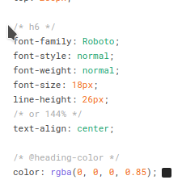
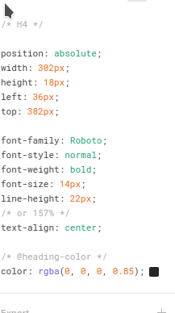

## r4H Code Conventions
### LEARN IT.  KNOW IT.  LIVE IT.

## ORDER OF CODE

- All important declarations must be made on the first screen
- - You should not have to scroll down
- - In publishing this is called "ABOVE THE FOLD", like the first page of a newspaper.

## CORRECT ORDER OF FILE:

1. Imports
2. Simple Consts
3. Main Component Declaration
4. Complex Consts
5. Styled-Components
6. Props interface
7. export default

## BlogPost.tsx

```tsx

import React from 'react';
import { Typography } from 'antd';
import styled from 'styled-components';

/* Simple Consts */
const { Text } = Typography;

/* Component Declaration */
const BlogPost: React.FC< BlogPostProps > = ({ title, description }) => (
   <BlogPostWrapper>
     <Title>{title}</Title>
     <Description>{description}</Description>
   </BlogPostWrapper>
);

/* Complex consts -- See section below on Function Closures*/

/* styled-component declarations */
const BlogPostWrapper = styled.div`margin: 5px;`;
const Title = styled.div`font-size: 125%;`;
const Description = styled.div`font-style: italic;`;

/* interface declaration -- do not use PropTypes */
interface BlogPostProps {
   title: string;
   description: string;
}

export default BlogPost;
```

## Constant Consts:  Function Closures

- Function closure imposes some limits on how far down we can place certain declarations. 
- - If the declaration uses a variable which is defined within the scope of the MainComponent, you have a function closure issue. 
- - Typescript complains "you can not use < SYMBOL_NAME > before it is declared"
- - Put all secondary declarations as low as possible
- - Perhaps tell the linter to ignore this error
- - -  I believe this is:
- - -   // eslint-disable-next-line @typescript-eslint/no-use-before-define
- - - or
- - -   // eslint-disable-next-line @typescript-eslint/no-use-before-declare

## Try to parameterize declarations rather than relying on function closures


BAD:

```tsx
import react;

const BadInnerComponentReliesOnClosureDiv = () => {
  const innerVariable = "foo";
  const InnerFunctionOrComponent = () => <div>{innerVariable}</div>

  return <InnerFunctionOrComponent/>
 }}
```


GOOD: 

```tsx
import react;

const GoodIndependantDiv = () => {
  const innerVariable = "foo";
  
  return <IndependantFunctionOrComponent>{innerVariable}</IndependantFunctionOrComponent>
 }}

 const IndependantFunctionOrComponent = (text) => (
    <div>{text}</div>
 )
```

## NAMING

- All Component Names follow standard OO Naming conventions

- - Inheritance Relationships can be indicated by appending the name of the subclass
- - All styled-components must have meaningful names that indicate their usage within the markup.
- - They must be treated exactly the same as React Components
- - The root styled-component for the module is {ModuleName}Wrapper
- - -  Never use the suffix "Container" or "Component" for a styled component.  That is the name of the file export.  Always use the suffix "Wrapper"
- - Never use a generic name that will clash with AntD components
- - https://blog.elpassion.com/naming-101-quick-guide-on-how-to-name-things-a9bcbfd02f02
- - All css must occur in styled-components

---

## Template Strings

- When you are in vscode, you see the path to the string in en.json. This path should match the actual filepath where the string is used and should have a final name that corresponds to the meaning and usage of the string.


NOTE:  This screenshot is not exactly right.  The path of the string should correspond to the path of the file.

## Generic Components in Figma

Check Figma for styles -- it already has styles in it.  We need to create a generic component library in src/components/figma


A name should always correspond to the component's usage and function.  How has UIUX broken down the layout.  Figure it out or talk to them.  Is there MainText and SecondaryText?  InfoBoxes and ExplanationBoxes?

What should we name this style?  Is it really an H6?  What is a good name for it?




Be careful because figma is not always consistent in its usage of H4 or H6.  for example, they may throw in a font-weight: 700.  Create a simple concise name for a reusable component

What is this one called?




src/components/figma

Distinguish

- TextStyle components (eg font-weight: 700px) are SPANS
- BlockStyle components (eg margin: 25px) are DIVS

## MainText.tsx :

```tsx
import react;
import styles;

export default styled.span `font-size: 150%;`
```

## InfoBox.tsx :

```tsx
import react;
import styles;


export default styled.div `margin: 20px;`
```

## index.tsx:

```tsx
import MainText from './MainText'
import InfoBox from './InfoBox'

export {MainText, InfoBox}
```